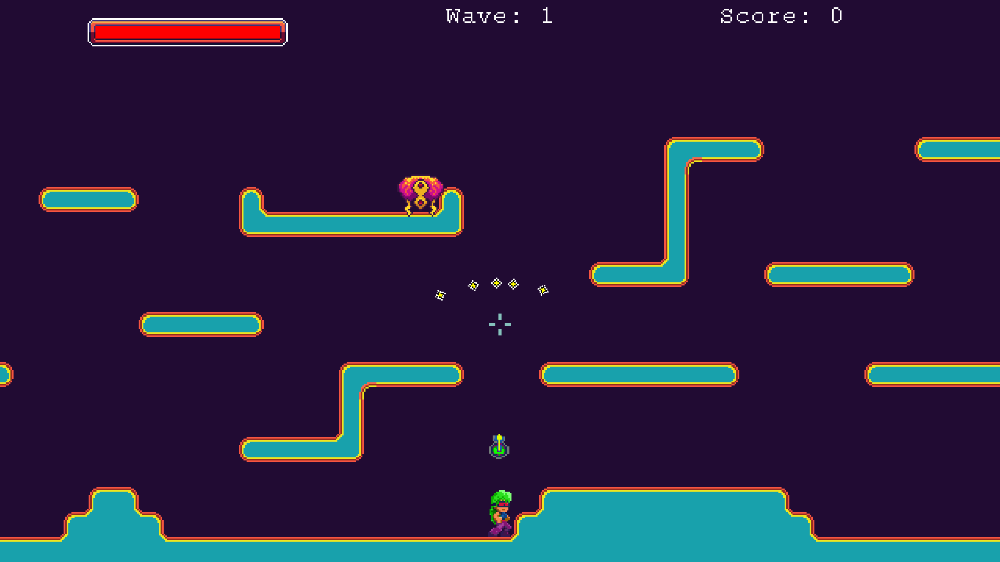

## Bullethell / Platformer demo

We worked on a demo that was a cross between a platformer and a bullet hell style game a few years ago in Gamemaker Studio 2. We stopped due to some limitaitons in the engine we didn't know how to overcome. I'd like to convert the code to the Unity engine which has a larger community and resources. Here are a few screenshots of the original concept and artwork for posterity.

### Original build

>We first started out making the game using megaman influences and thought it would look cool in black and white -- like a retro gameboy game. The game's enemies come in waves which serves as levels of difficulty. We got the player movement and machinegun down.  We wanted large bullets that produced screenshake and a meaty sound. Vlambeer made a great video about gamefeel that was inspiring. There was a lifebar, a highscore and a single enemy type.   

### Experimenting with color

>As we added a second larger enemy type, we experimented with color to see how it would work for the game. The color really adds a lot more life to the game.

### Full color

>We decided to go full on 80's neon synthwave as my color theme. The protagonist is now a female with more interesting hair and clothing. The gun was detached from the player which can be controlled by a mouse. You can't see it here, but the number of run frames were also increased from 4 to 12.

### Additional weapons and items

>We experimented with different weapon types like shotguns, cannon balls that bouce around and grenade launcers. Finally, we added health pickups as well.

### Conclusion

In the end, we had a lot of trouble implementing ladders and floors that we could jump through. Gamemaker felt a bit limiting and we ran into a lot of snags that eventually caused us to stall. The GML language was a bit limiting as it wasn't fully fleshed out and didn't allow for many features of a normal programming language. The built in physics functions were like a black box and performed poorly. Hopefully we can revive this project in Unity in the future.
